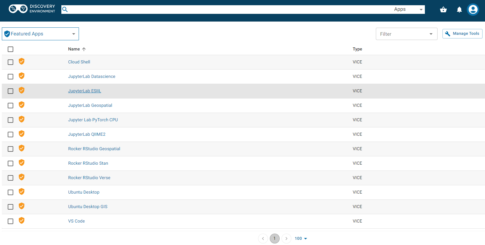
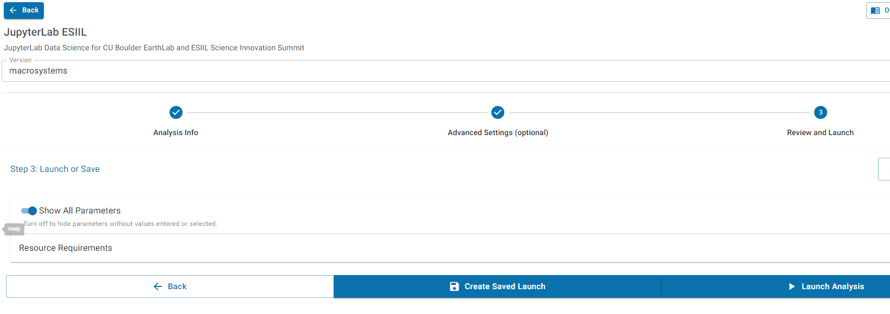
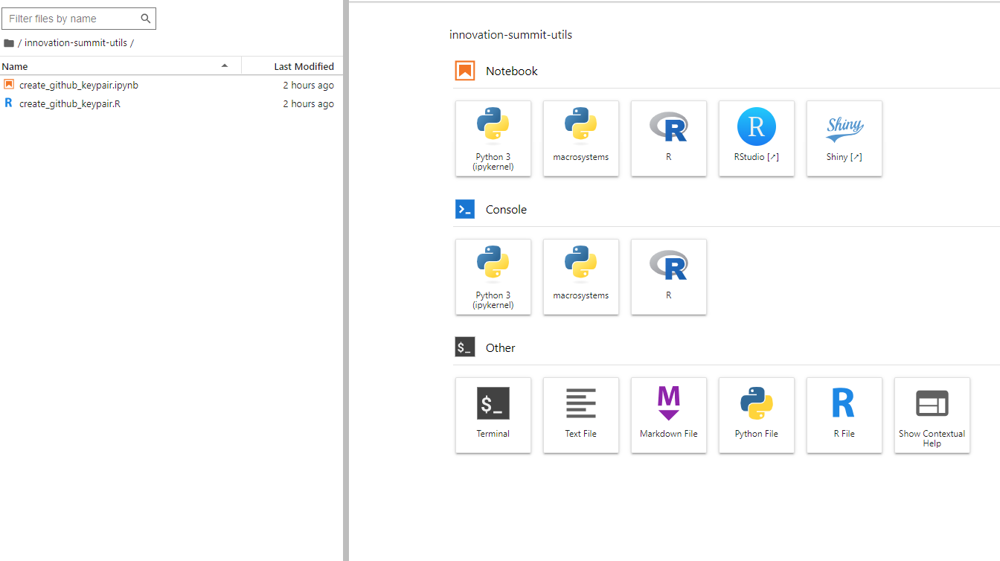

# Connecting to Cyverse and GitHub

## Log in to Cyverse

1. Go to the Cyverse user account website [https://user.cyverse.org/](https://user.cyverse.org/)

2. Click `Sign up` (if you do not already have an account). When you make this account, please use the email that you have been using to communicate with our team regarding the event. That email is attached to our CyVerse workshop.

   

3. Log in to Cyverse [https://user.cyverse.org/](https://user.cyverse.org/) with your new account.

   

4. From your account, go to the navigation bar at left and select 'Workshops'

5. From the workshop page, find the workshop titled "Forest Carbon Codefest". It should look like this:

6. Click on the tile, and then on the page for the workshop, click, "Enroll" at upper right. You should be enrolled automatically if you are using the email you have given our team.

7. Head over to the Cyverse Discovery Environment by clicking on 'Services' at the upper right and then 'Discovery Environment' under 'My Services'.

   You should now see the Discovery Environment:

   

## Open up an analysis with the hackathon environment (Jupyter Lab)

1. From the Cyverse Discovery Environment, click on `Apps` in the left menu

   

2. Select `JupyterLab ESIIL`

3. Configure and launch your analysis - the defaults are fine for now:

  

4. Click `Go to analysis`:

   

5. Now you should see Jupyter Lab!
   

## Set up your GitHub credentials

### If you would prefer to follow a video instead of a written outline, we have prepared a video here:

1. From Jupyter Lab, click on the GitHub icon on the left menu:

   

2. Click `Clone a Repository`:

   

3. Paste the link to the innovation-summit-utils [https://github.com/CU-ESIIL/innovation-summit-utils.git](https://github.com/CU-ESIIL/innovation-summit-utils.git) and click `Clone`:

   

4. You should now see the `innovation-summit-utils` folder in your directory tree (provided you haven't changed directories from the default `/home/jovyan/data-store`

   

5. Go into the `innovation-summit-utils` folder:

   

6. open up the `create_github_keypair.ipynb` notebook by double-clicking:

7. Select the default kernel

   

8. Now you should see the notebook open. Click the `play` button at the top. You will be prompted to enter your GitHub username and email:

   

   

   

9. You should now see your Public Key. Copy the WHOLE LINE including `ssh-ed25519` at the beginning and the `jovyan@...` at the end

10. Go to your GitHub settings page (you may need to log in to GitHub first):

    

11. Select `SSH and GPG keys`

    

12. Select `New SSH key`

    

13. Give your key a descriptive name, paste your ENTIRE public key in the `Key` input box, and click `Add SSH Key`. You may need to re-authenticate with your password or two-factor authentication.:

    

14. You should now see your new SSH key in your `Authentication Keys` list! Now you will be able to clone private repositories and push changes to GitHub from your Cyverse analysis!

    

> NOTE! Your GitHub authentication is ONLY for the analysis you're working with right now. You will be able to use it as long as you want there, but once you start a new analysis you will need to go through this process again. Feel free to delete keys from old analyses that have been shut down.