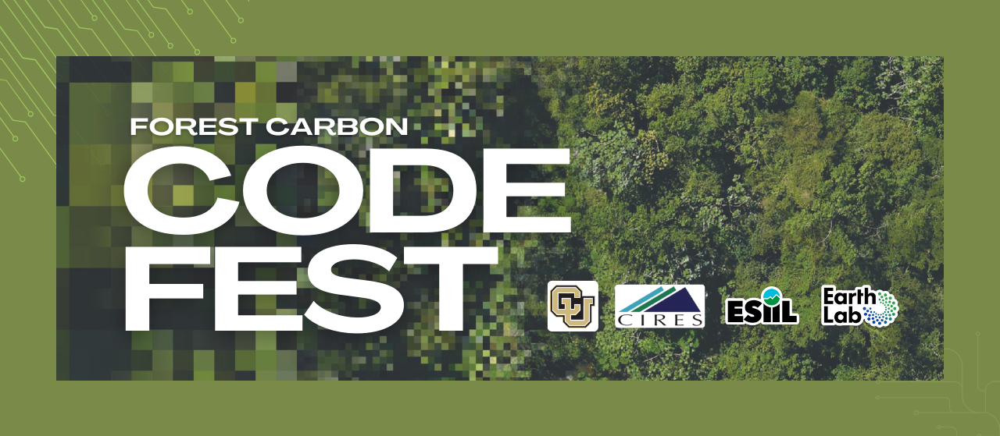

# Forest Carbon CodeFest

March 12-14, 2024

Forests have the potential to regulate a changing climate through uptake of carbon dioxide. However, this function is being compromised by increasing wildfires and other disturbances, particularly in the western U.S. The goal of the Forest Carbon Codefest is for teams to use cyberinfrastructure and a curated set of data to define their own scientific questions that advance our understanding of aboveground forest carbon dynamics as they relate to forest disturbance. Teams will then collaboratively answer that question in the form of a fully open, reproducible, and complete code script.

At the end of the event, projects will be judged by the participant community and facilitation team, with a prize awarded to each member of the winning team.

Our passionate cohort of participants for the event includes individuals from academia, land management, and industry, across a range of career stages.

Code generated for the event can be found on [our GitHub repo](https://github.com/CU-ESIIL/forest-carbon-codefest) (or, in the case of team code products, linked on our GitHub repo), and is available for use under an MIT license.

# Teams

Participants in the Forest Carbon Codefest were divided into 6 teams of 5 participants. Those groups are listed below.

| First name            | Last name             | Email                                      | Team | Tech Lead |
|-----------------------|-----------------------|--------------------------------------------|------|-----------|
| Lilli                 | Kaarakka              | lkaarakk@calpoly.edu                       | 1    |*|
| Charles               | Zhang                 | charleszhang216@gmail.com                  | 1    | |
| Alex                  | Vierod                | alex.vierod@bezerocarbon.com               | 1    | |
| Ethan                 | Yackulic              | ethan@vibrantplanet.net                    | 1    | |
| Nicole                | Hemming-Schroeder     | nicole.hemming-schroeder@colorado.edu      | 1    | |
| Leonard               | Strnad                | ljstrnadiii@gmail.com                      | 2    |*|
| Mike                  | Packard               | michael.packard@usda.gov                   | 2    | |
| Mihir                 | Bendre                | mihirobendre@utexas.edu                    | 2    | |
| Dafeng                | Zhang                 | dafeng_zhang@brown.edu                     | 2    | |
| Sarah                 | Hart                  | Sarah.Hart@colostate.edu                   | 2    | |
| Jiaming               | Lu                    | jmlu@terpmail.umd.edu                      | 3    |*|
| Martha                | Morrissey             | martha@pachama.com                         | 3    | |
| Asha                  | Paudel                | paudelasha@gmail.com                       | 3    | |
| Erick                 | Crockett              | erin.crockett@ubc.ca                       | 3    | |
| Tatum                 | VanHawkins            | Tatum.vanhawkins@gmail.com                 | 3    | |
| Elizabeth             | Buhr                  | buhre@caryinstitute.org                    | 4    |*|
| Quintin (Hutch)       | Tyree                 | qtyree@umass.edu                           | 4    | |
| Max                   | Joseph                | max.joseph@planet.com                      | 4    | |
| Hilary                | Brumberg              | Hibr1472@colorado.edu                      | 4    | |
| Kit                   | Lewers                | krle4401@colorado.edu                      | 4    | |
| Ryan                  | McCarthy              | rcm@planet.com                             | 5    |*|
| Rachel                | King                  | rking@nceas.ucsb.edu                       | 5    | |
| Julia                 | Kent                  | jkent@ucar.edu                             | 5    | |
| Ashley                | Woolman               | ashley.woolman@colostate.edu               | 5    | |
| Shike                 | Zhang                 | zhangsk@umich.edu                          | 5    | |
| Natalie               | Wiley                 | natalie.wiley@brilliantearth.com           | 6    |*|
| Bre                   | Powers                | brepowers@gmail.com                        | 6    | |
| Kylen                 | Solvik                | kyso1389@colorado.edu                      | 6    | |
| Tyler                 | Hoecker               | tyler.hoecker@vibrantplanet.net            | 6    | |
| Luis                  | de Pablo              | Luis.dePablo@colorado.edu                  | 6    | |

# Details

## Where  
In-person at the University of Colorado, Boulder  

## When  
March 12-14, 2024

# Event Documents

- [Event overview & official rules](https://docs.google.com/document/d/1el21bK1y2s7QlPMZGwckOaqwhWzW6Tt6CILTUBfjlCc/edit?usp=drive_link)
- [Project evaluation criteria](https://docs.google.com/document/d/1nMNbWuwLj-zqCxvk9fpxxHOeb1OQ48ah8thdLAHxakU/edit)
- [Code of conduct](https://docs.google.com/document/d/1BpqHKCaa_NZYQXPk2BHyPG3p9tjvWMJNsixn93mtAMU/edit?usp=drive_link)
- [Intellectual property participant agreement](https://docs.google.com/document/d/1jKXWrVzuhKWbRPtcRelxcSD9svh9rvTQUmadDV1Dy1I/edit?usp=drive_link)
- [Guidelines for intellectual contributions and credit](https://drive.google.com/file/d/1WcjV412EzCxohNtjFtca-o2Gpf36ISAX/view?usp=sharing)

*This event is hosted by ESIIL and the CU Boulder CIRES Earth Lab. It is funded by the National Science Foundation (via awards numbers DBI-2153040, DEB-1846384, and DEB-2017889), and subject to the NSF’s terms and conditions*

